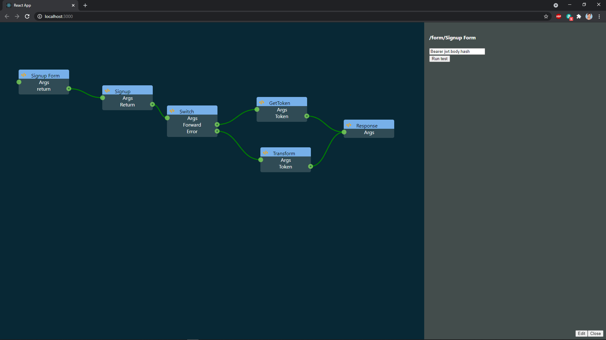
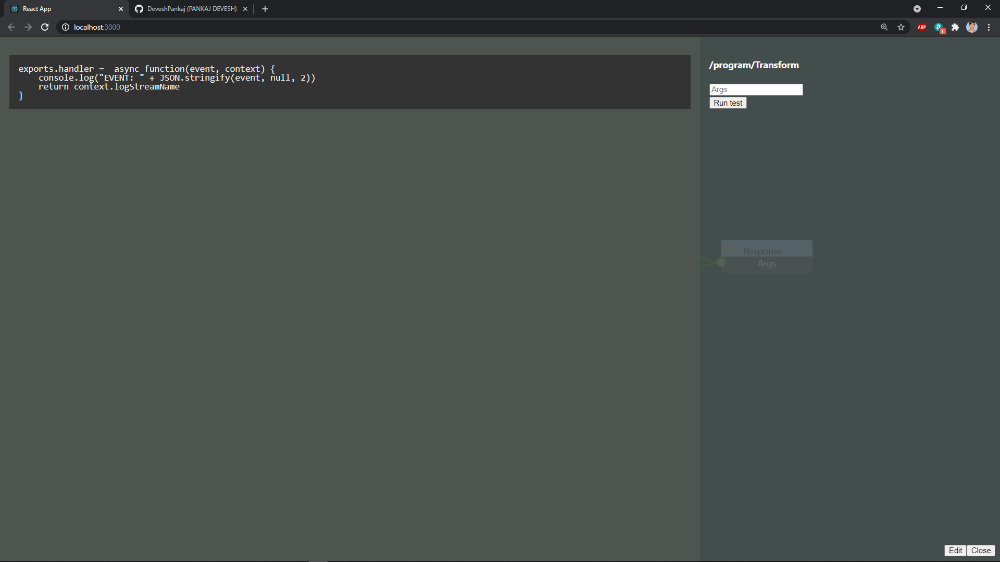

## microservice-builder 
microservice-builder is a [PWA](https://en.wikipedia.org/wiki/Progressive_web_application) [Visual programming](https://en.wikipedia.org/wiki/Visual_programming_language) tool to build, configure and test microservices in the browser.
It helps to auto-generate project structure and source in state of the art technology [TypeScript](https://www.typescriptlang.org/), it make use of [TypeScript AST](https://basarat.gitbook.io/typescript/overview/ast) to convert user define rules into code.
It forces developer to follow [Design Pattern](https://sourcemaking.com/design_patterns), write reusable code and to provide solution for distributed architecture.

## Tech Stack 
- [NodeJS](https://nodejs.org/en/docs/), [TypeScript](https://www.typescriptlang.org/), [Codegen](https://en.wikipedia.org/wiki/Code_generation_(compiler))
- [React](https://reactjs.org), [CSS](https://www.w3schools.com/css/)
- [TypeScript AST](https://basarat.gitbook.io/typescript/overview/ast)
- [ts-morph](https://www.npmjs.com/package/ts-morph)

## Available Scripts

In the project directory, you can run:

### `npm start`

Runs the app in the development mode.\
Open [http://localhost:3000](http://localhost:3000) to view it in the browser.

The page will reload if you make edits.

